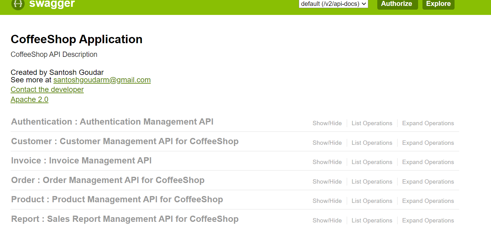
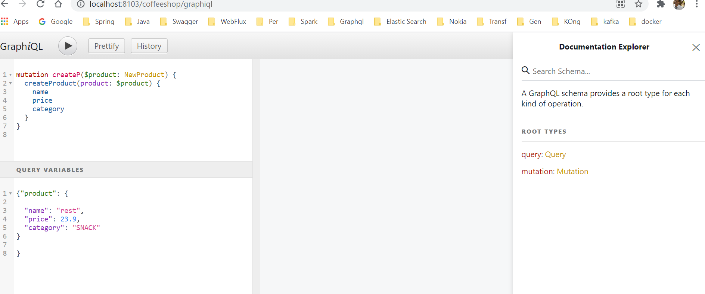

# CoffeeShopApplication
This contains REST API's for Product,Customer and Order,Report,Invoice management in coffeeshop.
Below is the swagger

This application needs mongoDB with localhost:21017 without any authentication and use details.
This application is just a sample application which covers spring-data-mongo, springboot, spring security, jwt token based authentication, sending email, report generation.
REST API's
1. Authentication Management-
addUser - add an user with name,password and role (ADMIN or USER).
login - authenticates the user with name and password and return the JWT token which should be included in sequential API calls.
   
Run the application and open swagger at the location http://localhost:8103/coffeeshop/swagger-ui.html

Branch- springboot_graphql

Graphql sample application based on spring boot - where products query and fetchers are added with schema.

Run the application and open
http://localhost:8103/coffeeshop/graphiql